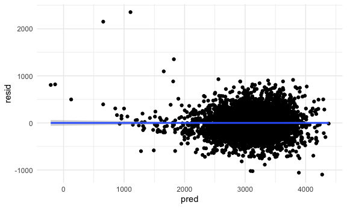
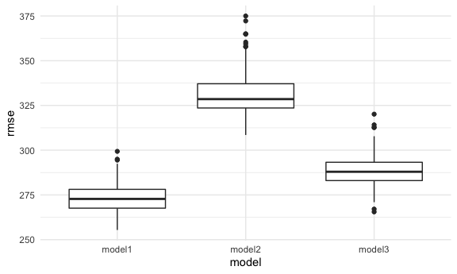

hw6?im2557
================
IRENE MARTINEZ MORATA (UNI: im2557)
11/30/2021

# Problem 1

``` r
birth <- read.csv("birthweight.csv") %>% 
  mutate(babysex = recode(babysex, 
                          "1" = "Male",
                          "2" = "Female"),
         fincome = fincome * 100,
         frace = recode(frace,
                        "1" = "White",
                        "2" = "Black",
                        "3" = "Asian",
                        "4" = "Puetro Rican",
                        "8" = "Other",
                        "9" = "Unknown"),
         malform = recode(malform, 
                          "0" = "Yes",
                          "1" = "No"
                          ),
         mrace = recode(mrace,
                        "1" = "White",
                        "2" = "Black",
                        "3" = "Asian",
                        "4" = "Puetro Rican",
                        "8" = "Other")
         ) 
sum(is.na(birth))
```

    ## [1] 0

## Create a linear model and plots

``` r
model_1 = lm(bwt ~ babysex + bhead + blength + delwt + fincome + gaweeks + mheight + mrace + parity + ppwt + smoken, data = birth) 
summary(model_1)
```

    ## 
    ## Call:
    ## lm(formula = bwt ~ babysex + bhead + blength + delwt + fincome + 
    ##     gaweeks + mheight + mrace + parity + ppwt + smoken, data = birth)
    ## 
    ## Residuals:
    ##      Min       1Q   Median       3Q      Max 
    ## -1097.18  -185.52    -3.39   174.14  2353.44 
    ## 
    ## Coefficients:
    ##                     Estimate Std. Error t value Pr(>|t|)    
    ## (Intercept)       -6.145e+03  1.419e+02 -43.291  < 2e-16 ***
    ## babysexMale       -2.856e+01  8.455e+00  -3.378 0.000737 ***
    ## bhead              1.308e+02  3.447e+00  37.944  < 2e-16 ***
    ## blength            7.495e+01  2.019e+00  37.120  < 2e-16 ***
    ## delwt              4.107e+00  3.921e-01  10.475  < 2e-16 ***
    ## fincome            3.180e-03  1.747e-03   1.820 0.068844 .  
    ## gaweeks            1.159e+01  1.462e+00   7.929 2.79e-15 ***
    ## mheight            6.594e+00  1.785e+00   3.694 0.000223 ***
    ## mraceBlack        -6.391e+01  4.237e+01  -1.508 0.131523    
    ## mracePuetro Rican -2.579e+01  4.535e+01  -0.569 0.569578    
    ## mraceWhite         7.489e+01  4.231e+01   1.770 0.076837 .  
    ## parity             9.630e+01  4.034e+01   2.388 0.017004 *  
    ## ppwt              -2.676e+00  4.274e-01  -6.261 4.20e-10 ***
    ## smoken            -4.843e+00  5.856e-01  -8.271  < 2e-16 ***
    ## ---
    ## Signif. codes:  0 '***' 0.001 '**' 0.01 '*' 0.05 '.' 0.1 ' ' 1
    ## 
    ## Residual standard error: 272.3 on 4328 degrees of freedom
    ## Multiple R-squared:  0.7181, Adjusted R-squared:  0.7173 
    ## F-statistic: 848.1 on 13 and 4328 DF,  p-value: < 2.2e-16

``` r
birth %>%
  modelr::add_residuals(model_1) %>%
  modelr::add_predictions(model_1) %>%
  ggplot(aes(x = pred, y = resid)) +
  geom_point() +
  geom_smooth(method='lm', formula= y~x)
```


\#\#Create comparison models

``` r
model_2 = lm(bwt ~ blength + gaweeks, data = birth)
model_3 = lm(bwt ~ (bhead + blength + babysex)^3, data = birth)


crossv_mc(birth, 100)%>% 
  mutate(
    train = map(train, as_tibble),
    test = map(test, as_tibble)) %>% 
    mutate(model_1  = map(train, 
                     ~lm(bwt ~ babysex + bhead + blength + delwt + fincome + 
                           gaweeks + mheight + mrace + parity + ppwt + smoken, data = .x)),
         
         model_2  = map(train, ~lm(bwt ~ blength + gaweeks, data = .x)),
         
         model_3 = map(train, ~lm(bwt ~ (bhead + blength + babysex)^3, data = .x))
         )%>%
  mutate(rmse_model1 = map2_dbl(model_1, test, ~rmse(model = .x, data = .y)),
         rmse_model2 = map2_dbl(model_2, test, ~rmse(model = .x, data = .y)),
         rmse_model3 = map2_dbl(model_3, test, ~rmse(model = .x, data = .y))) %>%
    select(starts_with("rmse")) %>% 
  pivot_longer(
      everything(),
      names_to = "model", 
      values_to = "rmse",
      names_prefix = "rmse_") %>% 
    mutate(model = fct_inorder(model)) %>% 
    ggplot(aes(x = model, y = rmse)) +
  geom_boxplot()
```

    ## Warning in predict.lm(model, data): prediction from a rank-deficient fit may be
    ## misleading


